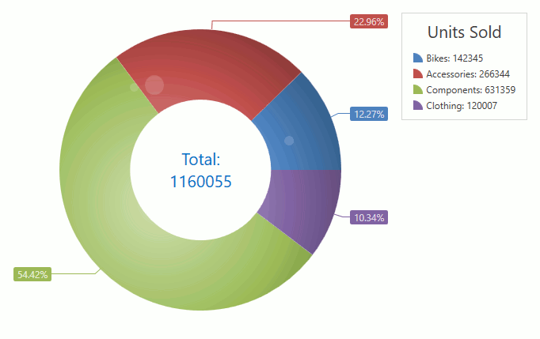

<!-- default badges list -->

<!-- default badges end -->
<!-- default file list -->
*Files to look at*:

* [Window1.xaml](./CS/Window1.xaml) (VB: [Window1.xaml](./VB/Window1.xaml))
* [Window1.xaml.cs](./CS/Window1.xaml.cs) (VB: [Window1.xaml.vb](./VB/Window1.xaml.vb))

<!-- default file list end -->

# How to create a 2D Pie (Donut) chart

This example demonstrates how to create a 2D Pie chart. 

Create a [ChartControl](https://documentation.devexpress.com/WPF/DevExpress.Xpf.Charts.ChartControl.class) and specify its [ChartControl.Diagram](https://documentation.devexpress.com/WPF/DevExpress.Xpf.Charts.ChartControl.Diagram.property) property to a [SimpleDiagram2D](https://documentation.devexpress.com/WPF/DevExpress.Xpf.Charts.SimpleDiagram2D.class) object. 

> Note that the **ChartControl.Diagram** is a content property. You can declare a diagram in XAML directly after a chart control's declaration without wrapping it in opening and closing **ChartControl.Diagram** tags.

Add a [PieSeries2D](https://documentation.devexpress.com/WPF/DevExpress.Xpf.Charts.PieSeries2D.class) object to the [Diagram.Series](https://documentation.devexpress.com/WPF/DevExpress.Xpf.Charts.Diagram.Series.property) collection.

> Note that the **Diagram.Series** is a content property. You can declare series in XAML directly after a diagram's declaration without wrapping them in opening and closing **Diagram.Series** tags.

Use the following properties to bind the [series](https://documentation.devexpress.com/WPF/6339/Controls-and-Libraries/Charts-Suite/Chart-Control/Chart-Elements/Series) to data:

- [Series.DataSource](https://documentation.devexpress.com/WPF/DevExpress.Xpf.Charts.Series.DataSource.property) - Specifies the series's data source.
- [Series.ArgumentDataMember](https://documentation.devexpress.com/WPF/DevExpress.Xpf.Charts.Series.ArgumentDataMember.property) - Defines the data member that provides the series's arguments.
- [Series.ValueDataMember](https://documentation.devexpress.com/WPF/DevExpress.Xpf.Charts.Series.ValueDataMember.property) - Specifies the data member that provides the series's values.

The [PieSeries2D.Model](https://documentation.devexpress.com/WPF/DevExpress.Xpf.Charts.PieSeries2D.Model.property) property allows you to change the series appearance using the built-in models. This example uses the [GlarePie2DModel](https://documentation.devexpress.com/WPF/DevExpress.Xpf.Charts.GlarePie2DModel.class) model.

Use the [Series.LegendTextPattern](https://documentation.devexpress.com/WPF/DevExpress.Xpf.Charts.Series.LegendTextPattern.property) property to specify how to format text that identifies series points in the [legend](https://documentation.devexpress.com/WPF/6343/Controls-and-Libraries/Charts-Suite/Chart-Control/Chart-Elements/Legends).

The [SeriesLabel.TextPattern](https://documentation.devexpress.com/WPF/DevExpress.Xpf.Charts.SeriesLabel.TextPattern.property) property defines how to configure [series labels](https://documentation.devexpress.com/WPF/6341/Controls-and-Libraries/Charts-Suite/Chart-Control/Chart-Elements/Series/Series-Point-Labels)' text.

The [PieTotalLabel.TextPattern](https://documentation.devexpress.com/WPF/DevExpress.Xpf.Charts.PieTotalLabel.TextPattern.property) property allows you to specify the center label's content.
<!-- feedback -->
## Does this example address your development requirements/objectives?

 

(you will be redirected to DevExpress.com to submit your response)
<!-- feedback end -->
